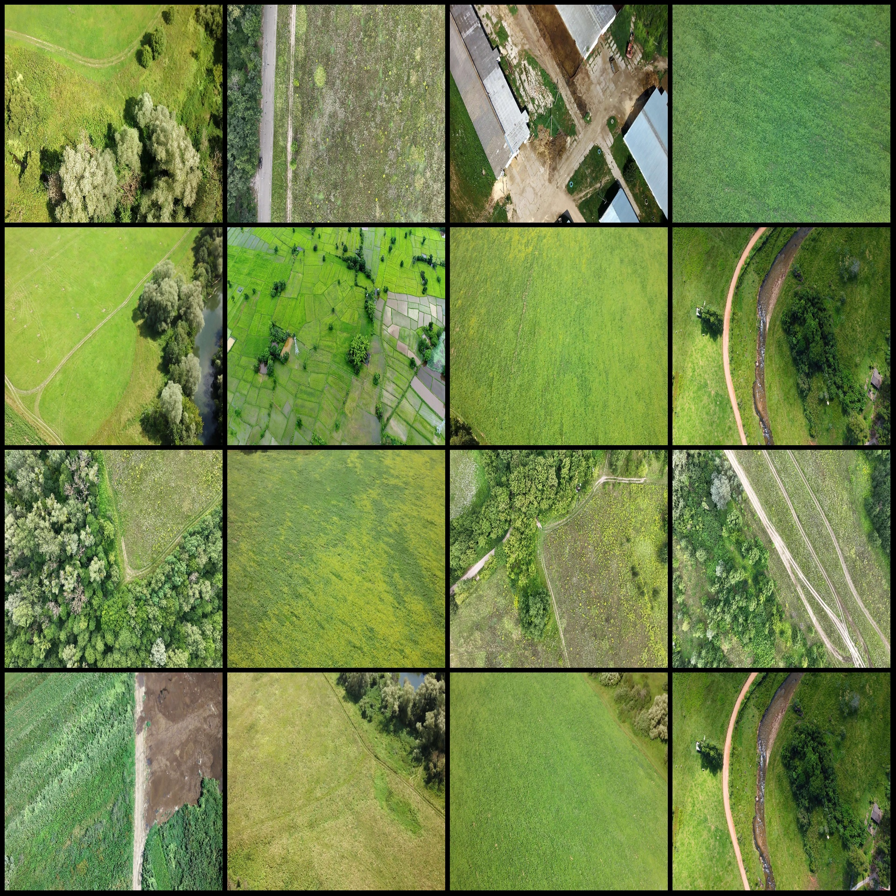
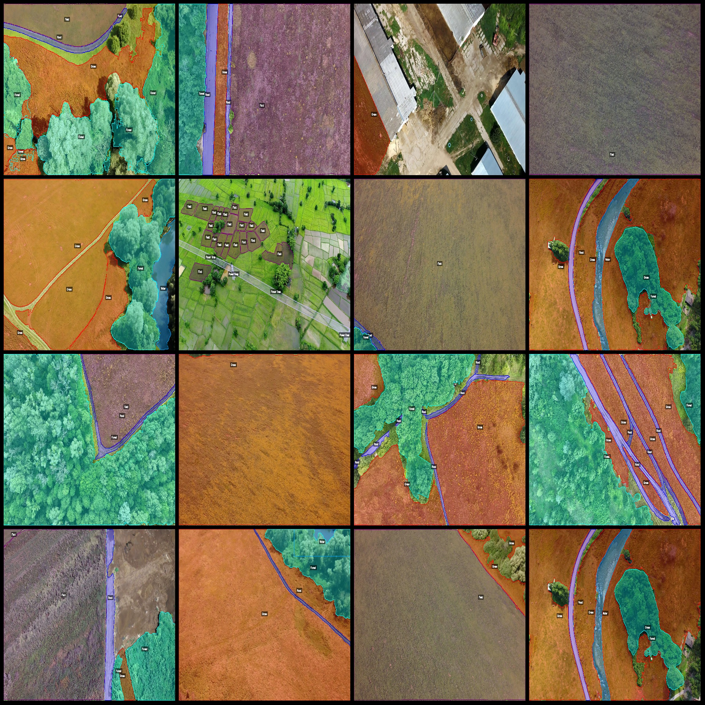
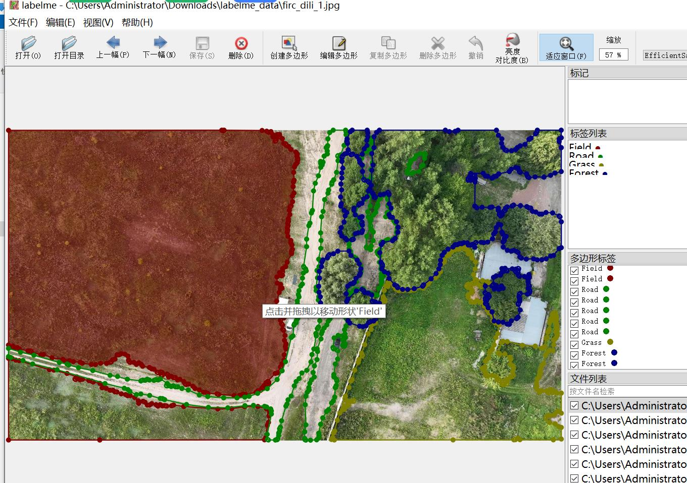

# Drone-View Geometric Features Segmentation Dataset - LabelMe Format with 1536 Images and 6 Categories

**Dataset Format:** LabelMe format (excluding mask files, only containing jpg images and corresponding json files)

**Image Count:** 1536 jpg files

**Annotation Count:** 1536

**Number of Annotation Categories:** 6

**Annotation Category Names:** ["Field", "Road", "Grass", "Forest", "Water", "Power lines"]

**Box Count for Each Category:**
- Field (Plain Field) count = 1244
- Road (Road) count = 2182
- Grass (Grassland) count = 2287
- Forest (Forested Area) count = 2004
- Water (Water Body) count = 576
- Power lines (Power Lines) count = 439

Total Boxes: 8732

**Using LabelMe Tool:** labelme=5.5.0

**Image Resolution:** 1920x1080

**Drone: DJI MAVIC 3**

**Collection Altitude:** 50m

**Collection Angle:** 90°

**Annotation Rules:** Polygon is drawn around each category.

**Important Note:** The dataset can be opened and edited in LabelMe, but the json dataset needs to be converted into either a mask or instance segmentation format using yolo or coco.

**Special Disclaimer:** This dataset does not guarantee any accuracy in the training models or weights files.

**Image Preview:**
- **Original Images (choose 16 images at any time):**

- **Annotation Results:**

- **Annotation Example:**

## Images

Here is a pay link on Stripe ( https://buy.stripe.com/3cs8yP7sY87d0vu9AB ). Please contact me lonlonago@foxmail.com after funding $89, and I will send you a complete data files , thank you!

